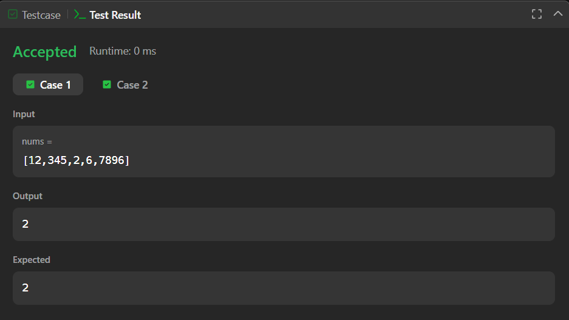

# 1295. Find Numbers with Even Number of Digits – Java Solution

This repository contains a Java solution for the **LeetCode problem: Find Numbers with Even Number of Digits**.

The solution determines how many numbers in a given array contain an **even number of digits** using a digit-counting approach.

---

## 📌 Problem Overview

Given an integer array, the task is to count how many elements in the array have an **even number of digits**.

This problem is commonly used to test understanding of:
- Number manipulation
- Looping logic
- Basic mathematical operations

---

## 🧪 Code Functionality

- Iterates through each number in the array  
- Counts digits by repeatedly dividing the number by `10`  
- Checks whether the digit count is even  
- Maintains a counter for valid numbers  
- Returns the final count  

---

## 🧠 Concepts Covered

- Arrays  
- Integer division  
- Digit counting logic  
- Looping constructs (`for`, `while`)  
- Conditional statements  

---

## ⏱️ Complexity Analysis

- **Time Complexity:** `O(n × d)`  
  *(where `d` is the number of digits in a number)*  
- **Space Complexity:** `O(1)`

---

## 🖥️ Screenshots

📸 **Test case execution result**  

📸 **LeetCode submission result**  

---

## 📂 File Information

- `Solution.java` — Java source code  
- `testcases.png` — Screenshot of test case execution  
- `submission.png` — Screenshot of accepted submission  
- `README.md` — Problem documentation  

---

## ⚠️ Notes

- The input array values are modified during digit counting  
- Logic is correct but can be improved by using a temporary variable  
- Suitable for beginner-level DSA and interview practice  

---

## 👨‍💻 Author

**Shreya Awari**  
📧 Email: shreyaawari31@gmail.com  
🌐 GitHub: https://github.com/shreyaawari28  
💼 LinkedIn: https://www.linkedin.com/in/shreya-awari-/
