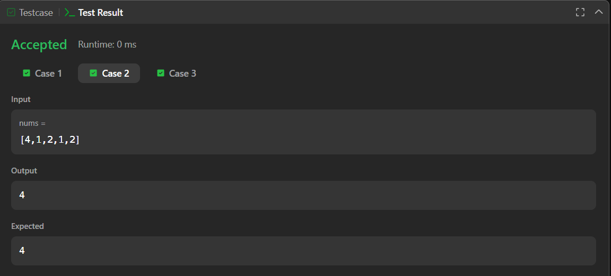
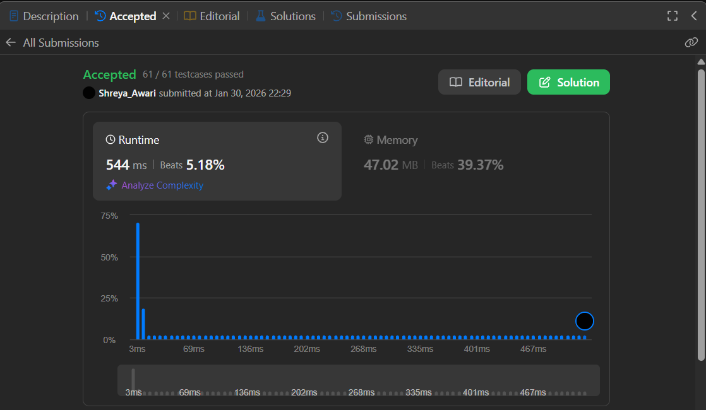

# 136. Single Number – Java Solution

This repository contains a Java solution for the **LeetCode problem: Single Number**.

The solution finds the element that appears **only once** in an array where every other element appears **exactly twice**.

---

## 📌 Problem Overview

Given a non-empty integer array, every element appears twice except for one element.  
The task is to identify and return that **unique element**.

This problem is commonly used to evaluate:
- Array traversal skills
- Logical reasoning
- Understanding of frequency-based problems

---

## 🧪 Code Functionality

- Iterates through each element of the array  
- Compares the current element with all other elements  
- Counts the number of occurrences  
- Identifies the element that appears only once  
- Returns the unique element  

---

## 🧠 Concepts Covered

- Arrays  
- Nested loops  
- Frequency counting  
- Conditional logic  
- Brute-force search approach  

---

## ⏱️ Complexity Analysis

- **Time Complexity:** `O(n²)`  
- **Space Complexity:** `O(1)`

---

## 🖥️ Screenshots

📸 **Test case execution result**  

📸 **LeetCode submission result**  

---

## 📂 File Information

- `Solution.java` — Java source code  
- `testcases.png` — Screenshot of test case execution  
- `submission.png` — Screenshot of accepted submission  
- `README.md` — Problem documentation  

---

## ⚠️ Notes

- The solution is correct but not optimal  
- Does not meet the problem’s linear time requirement  
- Can be optimized using bitwise XOR for `O(n)` time  

---

## 👨‍💻 Author

**Shreya Awari**  
📧 Email: shreyaawari31@gmail.com  
🌐 GitHub: https://github.com/shreyaawari28  
💼 LinkedIn: https://www.linkedin.com/in/shreya-awari-/
