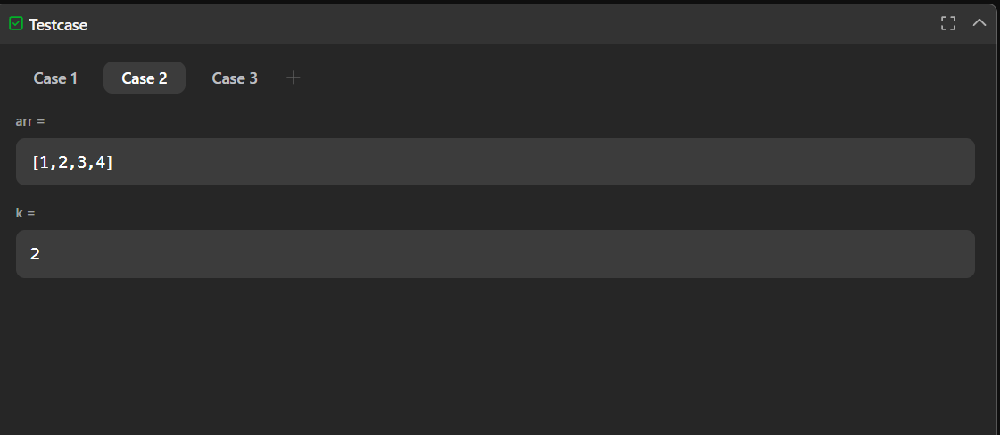

# 1539. Kth Missing Positive Number – Java Solution

This repository contains a Java solution for the **LeetCode problem: Kth Missing Positive Number**.

The solution finds the `k`th missing positive integer from a strictly increasing sorted array using a brute-force checking approach.

---

## 📌 Problem Overview

Given an array of positive integers sorted in strictly increasing order and an integer `k`, the task is to return the `k`th positive integer that is missing from the array.

This problem is commonly used to evaluate:
- Array traversal
- Missing element detection
- Brute-force vs optimized approaches

---

## 🧪 Code Functionality

- Iterates through positive integers starting from `1`
- Checks whether each number exists in the given array
- Stores missing numbers in a separate array
- Continues until enough missing numbers are collected
- Returns the `k`th missing positive number

---

## 🧠 Concepts Covered

- Arrays  
- Nested loops  
- Linear search  
- Missing number logic  
- Brute-force enumeration  

---

## ⏱️ Complexity Analysis

- **Time Complexity:** `O(n × m)`  
  *(where `n` is the range checked and `m` is the array length)*  
- **Space Complexity:** `O(n)` (extra array used)

---

## 🖥️ Screenshots

📸 **Test case execution result**  

📸 **LeetCode submission result**  

---

## 📂 File Information

- `Solution.java` — Java source code  
- `testcases.png` — Screenshot of test case execution  
- `submission.png` — Screenshot of accepted submission  
- `README.md` — Problem documentation  

---

## ⚠️ Notes

- The solution is correct but not optimized  
- Does not meet the follow-up requirement of less than `O(n)` complexity  
- Can be optimized using binary search or gap counting  
- Useful for understanding brute-force missing number logic  

---

## 👨‍💻 Author

**Shreya Awari**  
📧 Email: shreyaawari31@gmail.com  
🌐 GitHub: https://github.com/shreyaawari28  
💼 LinkedIn: https://www.linkedin.com/in/shreya-awari-/
