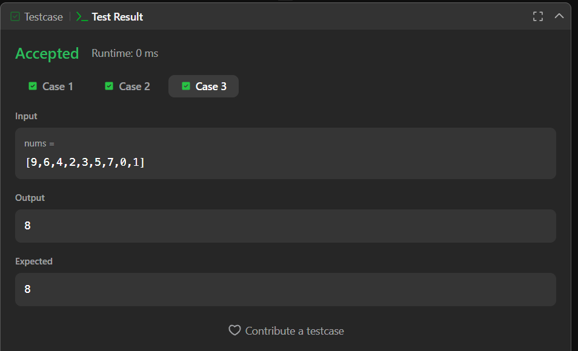

# 268. Missing Number – Java Solution

This repository contains a Java solution for the **LeetCode problem: Missing Number**.

The solution identifies the missing number from an array containing `n` distinct numbers taken from the range `[0, n]`.

---

## 📌 Problem Overview

Given an array of size `n` containing distinct numbers in the range `[0, n]`, exactly one number from the range is missing.  
The task is to find and return that missing number.

This problem is commonly used to test:
- Array traversal
- Logical reasoning
- Brute-force vs optimized thinking

---

## 🧪 Code Functionality

- Iterates through all numbers from `0` to `n`  
- For each number, checks whether it exists in the array  
- Uses a nested loop to count occurrences  
- Identifies the number that does not appear in the array  
- Returns the missing number  

---

## 🧠 Concepts Covered

- Arrays  
- Nested loops  
- Range-based iteration  
- Conditional statements  
- Brute-force searching  

---

## ⏱️ Complexity Analysis

- **Time Complexity:** `O(n²)`  
- **Space Complexity:** `O(1)`

---

## 🖥️ Screenshots

📸 **Test case execution result**  

📸 **LeetCode submission result**  

---

## 📂 File Information

- `Solution.java` — Java source code  
- `testcases.png` — Screenshot of test case execution  
- `submission.png` — Screenshot of accepted submission  
- `README.md` — Problem documentation  

---

## ⚠️ Notes

- The solution is correct but not optimal  
- Does not meet the expected linear time complexity  
- Can be optimized using XOR or summation formula  
- Suitable for understanding brute-force logic before optimization  

---

## 👨‍💻 Author

**Shreya Awari**  
📧 Email: shreyaawari31@gmail.com  
🌐 GitHub: https://github.com/shreyaawari28  
💼 LinkedIn: https://www.linkedin.com/in/shreya-awari-/

