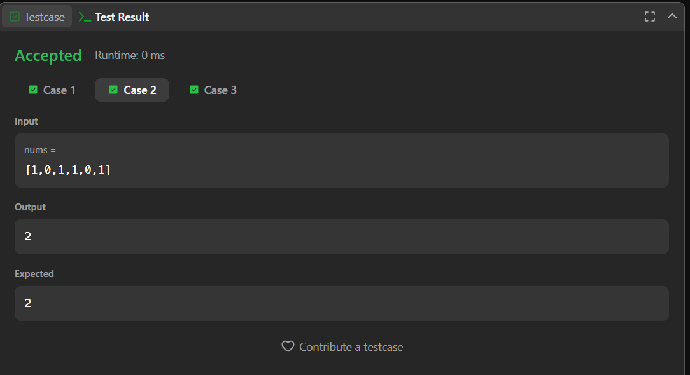
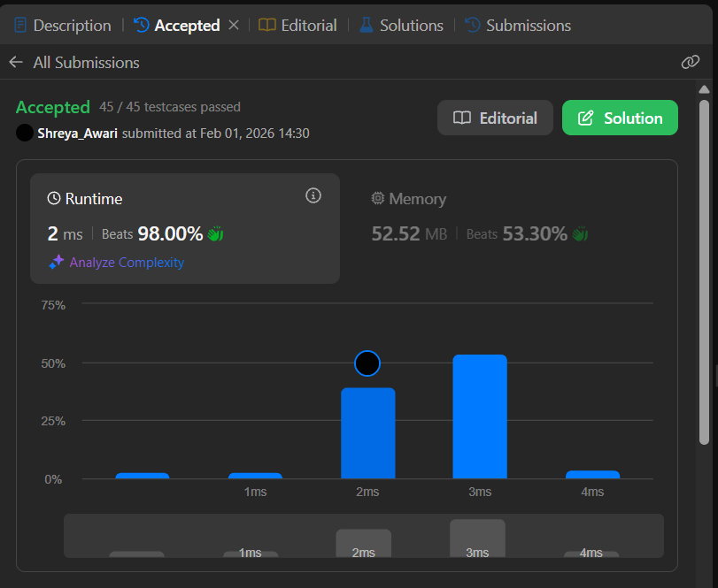

# 485. Max Consecutive Ones – Java Solution

This repository contains a Java solution for the **LeetCode problem: Max Consecutive Ones**.

The solution finds the maximum number of consecutive `1`s present in a binary array using a single-pass approach.

---

## 📌 Problem Overview

Given a binary array, the task is to determine the **maximum number of consecutive `1`s** in the array.

This problem is commonly used to test:
- Array traversal
- Counter-based logic
- Efficient single-pass solutions

---

## 🧪 Code Functionality

- Iterates through the array once  
- Increments a counter when `1` is encountered  
- Resets the counter when `0` is encountered  
- Tracks the maximum consecutive count of `1`s  
- Returns the maximum value found  

---

## 🧠 Concepts Covered

- Arrays  
- Linear traversal  
- Counter-based logic  
- Conditional statements  
- Single-pass optimization  

---

## ⏱️ Complexity Analysis

- **Time Complexity:** `O(n)`  
- **Space Complexity:** `O(1)`

---

## 🖥️ Screenshots

📸 **Test case execution result**  

📸 **LeetCode submission result**  

---

## 📂 File Information

- `Solution.java` — Java source code  
- `testcases.png` — Screenshot of test case execution  
- `submission.png` — Screenshot of accepted submission  
- `README.md` — Problem documentation  

---

## ⚠️ Notes

- The solution uses a single traversal of the array  
- No additional data structures are required  
- Fully meets the problem’s time and space constraints  
- Suitable for interview and beginner DSA practice  

---

## 👨‍💻 Author

**Shreya Awari**  
📧 Email: shreyaawari31@gmail.com  
🌐 GitHub: https://github.com/shreyaawari28  
💼 LinkedIn: https://www.linkedin.com/in/shreya-awari-/

