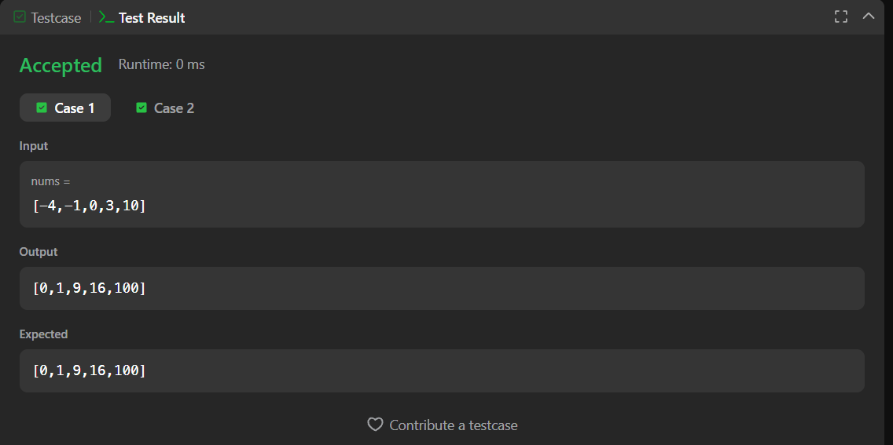
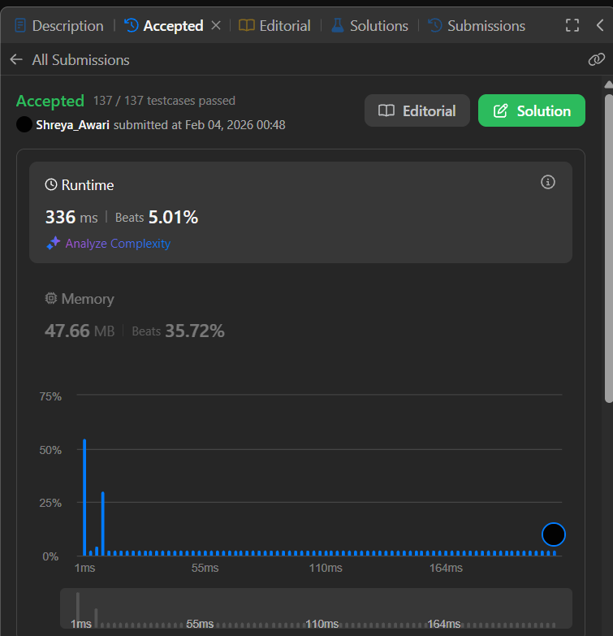

# 977. Squares of a Sorted Array – Java Solution

This repository contains a Java solution for the **LeetCode problem: Squares of a Sorted Array**.

The solution computes the square of each element in the array and then sorts the resulting values in non-decreasing order.

---

## 📌 Problem Overview

Given an integer array sorted in non-decreasing order, the task is to return a new array containing the **squares of each number**, also sorted in non-decreasing order.

This problem is commonly used to test:
- Array manipulation
- Understanding of sorting logic
- Trade-offs between brute-force and optimized approaches

---

## 🧪 Code Functionality

- Iterates through the array and squares each element  
- Sorts the squared values using a nested loop comparison  
- Modifies the array in place  
- Returns the sorted array of squared values  

---

## 🧠 Concepts Covered

- Arrays  
- Squaring elements  
- Nested loops  
- In-place sorting  
- Brute-force sorting approach  

---

## ⏱️ Complexity Analysis

- **Time Complexity:** `O(n²)`  
- **Space Complexity:** `O(1)` (in-place)

---

## 🖥️ Screenshots

📸 **Test case execution result**  

📸 **LeetCode submission result**  

---

## 📂 File Information

- `Solution.java` — Java source code  
- `testcases.png` — Screenshot of test case execution  
- `submission.png` — Screenshot of accepted submission  
- `README.md` — Problem documentation  

---

## ⚠️ Notes

- The solution is correct but not optimal  
- Time complexity does not meet the best possible solution  
- Can be optimized using a two-pointer approach for `O(n)` time  
- Suitable for understanding brute-force logic before optimization  

---

## 👨‍💻 Author

**Shreya Awari**  
📧 Email: shreyaawari31@gmail.com  
🌐 GitHub: https://github.com/shreyaawari28  
💼 LinkedIn: https://www.linkedin.com/in/shreya-awari-/

